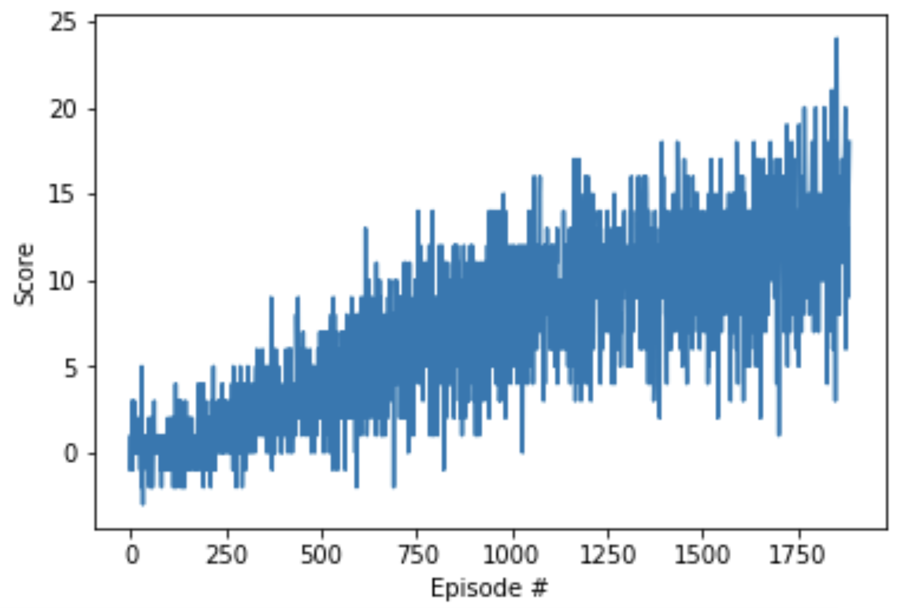

# Unity / Banana Collector environment / Double DQN Implementation with Huber Loss 
### (Udacity's Deep Reinforcement Learning project)
***

## Table of Contents
[1. Project Requirements](#project_requirement) 
- [1.1 Unity environments](#unity_environment) 
- [1.2 Banana collector environment](#banana_environment)
- [1.3 Solving the "Banana collector" environment](#solving_environment)

[2. Required Python libraries](#libraries)  
[3. Solution implemented](#solution)  
[4. Script: `navigation.py`](#navigation)  
- [4.1 Overview](#navigation_overview)  
- [4.2 CLI arguments](#navigation_arguments)  
- [4.3 Logging](#navigation_logging)  
- [4.4 Plots](#plots)  
- [4.5 CSV summaries](#csv_summaries) 
- [4.6 JSON files](#json_files) 
- [4.7 Model checkpoints](#model_checkpoints) 
- [4.8 2-step runs (commands)](#navigation_runs)

[5. Script: `extract_weights_n_load_into_policy.py`](#extract_weights_n_load_into_policy)  
> [5.1 Overview](#extract_weights_n_load_into_policy_overview)   
> [5.2 CLI arguments ](#extract_weights_n_load_into_policy_arguments)  
> [5.3 runs](#extract_weights_n_load_into_policy_run)  

[6. Repository structure (key items)](#repo_structure)  


***

<a id = 'project_requirement'></a>
# 1. Project Requirements

<a id = 'unity_environment'></a>
## 1.1 Unity environments

Unity Machine Learning Agents (ML-Agents) is an open-source Unity plugin that enables games and simulations to serve as environments for training intelligent agents.
For game developers, these trained agents can be used for multiple purposes, including controlling NPC behaviour (in a variety of settings such as multi-agent and adversarial), automated testing of game builds and evaluating different game design decisions pre-release.

<a id = 'reacher_environment'></a>
## 1.2. Reacher environment

This project aims to solve the Unity environment called **"Banana collector"** provided by Udacity. It can be downloaded from one of the links below:
- [Linux]( https://s3-us-west-1.amazonaws.com/udacity-drlnd/P1/Banana/Banana_Linux.zip)
- [Mac OSX]( https://s3-us-west-1.amazonaws.com/udacity-drlnd/P1/Banana/Banana.app.zip)
- [Windows (32-bit)]( https://s3-us-west-1.amazonaws.com/udacity-drlnd/P1/Banana/Banana_Windows_x86.zip)
- [Windows (64-bit)]( https://s3-us-west-1.amazonaws.com/udacity-drlnd/P1/Banana/Banana_Windows_x86_64.zip)

Note: this repository already includes a Windows build at `./Banana_Windows_x86_64/`.


<a id = 'solving_environment'></a>
## 1.3 Solving the "Reacher" environment

For this project, we will train an agent to navigate (and collect bananas!) in a large, square world.

A reward of `+1` is provided for collecting a yellow banana, and a reward of `-1` is provided for collecting a blue banana. Thus, the goal of the agent is to collect as many yellow bananas as possible while avoiding blue bananas.

The state space has `37 dimensions` and contains the agent's velocity, along with ray-based perception of objects around the agent's forward direction. Given this information, the agent has to learn how to best select actions. Four discrete actions are available, corresponding to:

    0 - move forward.
    1 - move backward.
    2 - turn left.
    3 - turn right.

The task is episodic, and in order to solve the environment, the agent must get an average score of `+13 over 100 consecutive episodes`.


As an indication, in the solution implemented by Udacity, the average score over 100 episodes has reached the threshold of `+13` ain fewer than `1800` episodes.



Our current solution aims to outperform Udacity's performance by reaching the threshold earlier than episode `1800` during the training phase. 

<a id = 'libraries'></a>
# 2.Required Python libraries


The requirements used for the experiment are:

- Matplotlib==3.5.3
- Numpy==1.18.5
- Torch==1.13.1+cu116
- Unityagents==0.4.0
- Python==3.7.6

Important note: `unityagents` is the legacy Python API used here to talk to a Unity-built environment `Banana.exe`. In that older API, the “brain” concept is specific to the older ML-Agents toolchain.

Do **not** use the "Banana collector" version provided by Unity on the [Unity ML-Agents GitHub page]( https://github.com/Unity-Technologies/ml-agents/blob/master/docs/Learning-Environment-Examples.md).

<a id = 'solution'></a>
# 3. Solution implemented

The solution uses a **Double DQN** agent with **Huber Loss**, which relies on:

- an **online state-action value function Q(s,a)** network 
- and  **target Q** network.

See [report.pdf](https://github.com/Datapyaddict/udacity-project-solving-reacher-unity-environment-20-agents/blob/main/report.pdf) for the methodology and results.

Two scripts are used:

- `navigation.py`
- `extract_weights_n_load_into_policy.py`

<a id = 'navigation'></a>
# 4. Script: `navigation.py`

<a id = 'navigation_overview'></a>
## 4.1 Overview

This script is an end-to-end training runner for a Double DQN agent on the Unity Banana collector environment.

It can run:

- one fixed set of hyperparameters (the default configuration), or
- a randomly sampled hyperparameter search over a predefined grid,

and it saves checkpoints, logs, plots, and CSV/JSON summaries under a timestamped results folder:

`results/navigation/run_YYYYMMDD_HHMMSS/`

However, in this experiment, it is run with the default hyperparameters and single seed. Hence, only one runs is referenced (folder `./results/navigation/`

The following features are elaborated in [report.pdf](https://github.com/Datapyaddict/udacity-project-solving-reacher-unity-environment-20-agents/blob/main/report.pdf):

- `Double DQN` per trial/seed.
- ε-greedy` for action selection with `ε schedule`.
- Replay buffer storing online transitions.
- Training with based-exploration strategy to build the replay buffer.
- Offline optimization via minibatch sampling from the replay buffer. 
- Huber Loss.
- Early stopping (goal performance, max time, max episodes).
- 1-episode evaluation after each training episode using a greedy (no-noise) strategy.
- Final evaluation using 100 episodes with a greedy strategy.

Note that **the path to the Banana.exe has to be set manually in the script**! This is not resolved automatically.

The script launches Unity in a separate worker process to isolate the Unity runtime from the training code. The main process talks to the worker via a `multiprocessing.Pipe` sending simple commands: `reset`, `step`, `close`.

Built-in defaults:

- `gamma=0.99`
- `max_minutes=2000`
- `max_episodes=2000`
- `goal_mean_100_reward=13`
- `final_eval_episodes=100`

<a id = 'navigation_arguments'></a>
## 4.2 CLI arguments

- `--search`: enables hyperparameter search over the search grid. If not provided, the script runs a single default configuration.

Search grid:

    - hidden_dims: [(64, 64), (128,128), (256,256)]    
    - optimizer: ['Adam']
    - lr: [1e-4, 3e-4, 5e-4]
    - buffer_size: [50000]
    - batch_size: [64]
    - init_epsilon : [1.0]
    - min_epsilon : [0.01, 0.05]
    - schedule: ['linear', 'exp']
    - decay_steps: [100_000, 300_000, 600_000]
    - tau_ratio: [0.25, 0.35]
    - n_warmup_batches: [5, 10]
    - target_update_every_steps: [100]


Default hyperparameters:

    - gamma = 0.99
    - hidden_dims`: (128,128)
    - optimizer: Adam
    - lr: 1e-4
    - buffer_size`: 50000
    - batch_size: 64
    - init_epsilon: 1
    - min_epsilon: 0.05
    - schedule: exp
    - decay_steps`: 300000
    - n_warmup_batches: 5
    - target_update_every: 100
    - tau_ratio: 0.3
    - use_huber: True
    - double_dqn: True
    - grad_clip: 10

- `--max-trials <int>` (default: 8): number of randomly sampled trials to run when `--search` is enabled.

Note that the seed is defaulted to 22. However, multiple seeds can be set.

<a id = 'navigation_logging'></a>
## 4.3 Logging (`run.log`)

Path:

- `results/navigation/run/run.log`

Contents:

- Same `INFO` lines as the console.
- One line per episode during training:
    - `elapsed_time` (HH:MM:SS)
    - `episode` (0-based in the log line)
    - `episode_steps`
    - `mean_reward_over_100_episodes_from_training (mean ± std)` (last up to 100)
    - `mean_exploration_ratio_over_100_episodes_from_training (mean ± std)` (last up to 100)
    - `mean_reward_over_100_episodes_from_eval (mean ± std)` (last up to 100)
- Info about reaching the goal, stopping conditions, final evaluation score.

<a id = 'plots'></a>
## 4.4 Plots

Plots are generated from evaluation rewards (not raw training rewards).

Per trial/seed evaluation plot:

- Directory: `results/navigation/run/plots/`
- Filename: `evaluation_mean100_{trial_id}_seed_{seed}.png`
- Curves:
    - Eval (per-episode): one greedy 1-episode evaluation score per training episode
    - Eval (100-episode MA): moving average over the last 100 evaluation scores
- A “goal window start” vertical line indicates the first episode of the 100-episode window where the moving average meets or exceeds the goal.

Best-trial plot (only when `--search` is enabled):

- Directory: `results/navigation/run/plots/`
- Filename: `{trial_id}_evaluation_mean100.png`
- One curve: Eval (100-episode MA) averaged across seeds

<a id = 'csv_summaries'></a>
## 4.5 CSV summaries

`plots_summary.csv`:

- Path: `results/navigation/run/plots_summary.csv`
- One row per trial/seed about early stopping cause, episode count, and (if solved) moving average at stop.
- Columns:
    - `trial_id`
    - `seed`
    - `cause` (`goal`, `time`, or `episodes`)
    - `episode`
    - `mean_100_eval_at_stop` (only if `cause == 'goal'`)
    - `plot_path`

`hparam_search.csv` (only when `--search` is enabled):

- Path: `results/navigation/run/hparam_search.csv`
- One row per hyperparameter trial.
- Columns:
    - `trial_id`
    - `avg` (mean of final scores across seeds)
    - `std` (std across seeds; `ddof=1` when multiple seeds; otherwise `0.0`)
    - `best_seed_score`
    - `seeds`
    - all hyperparameters (`hidden_dims`, `optimizer`, `lr`, `buffer_size`, `batch_size`, `exploration_noise_ratio`, `n_warmup_batches`, `target_update_every`, `tau`)

<a id = 'json_files'></a>
## 4.6 JSON files

`best_hparams.json` (only when `--search` is enabled):

- Path: `results/navigation/run/best_hparams.json`
- The file is a single json object saved after hyperparameter search finishes. It stores the best trial (by highest avg_score)'s performance and hyper-parameters .
- Contents:
    - best trial_id
    - avg_score : the mean of the per-seed final_eval_score values for this trial.
    - std score : the standard deviation across seeds of the per-seed final scores.
    - seeds : the exact seed list used, e.g. [12, 34, 56]
    - Hyperparameters:
        - `hidden_dims` : e.g. [256, 256]
        - `optimizer` (string): e.g. "Adam"
        - `lr` 
        - `buffer_size 
        - `batch_size` 
        - `exploration_noise_ratio` 
        - `n_warmup_batches` 
        - `target_update_every`
        - `tau` 
    - `scores_per_seed`

- For each trial_id/seed run, when the goal is reached, the file displays the episode when the run first meets the “solved” condition based on the evaluation 100-episode moving average.
- Path: per trial/seed agent run directory , e.g.:
  `results/navigation/run/trials/trial_001/seed_12/solved_evaluation_metric.json`
- Contents:
    - `Episode` : the 1-based training episode index at which the agent is first considered solved (i.e., the first episode where the conditions below are met).
    - `mean_100_eval` : the 100-episodes moving average of the 1-episode evaluation score 

<a id = 'model_checkpoints'></a>
## 4.7 Model checkpoints

- Only the online policy model is checkpointed (not critic, not optimizers).
- Path pattern:
  `results/navigation/run.../trials/trial_{trial}/seed_{seed}/checkpoints/online_policy_model.{episode}.tar`. e.g.: online_policy_model.99.tar

For simplicity, only the first and last episode checkpoints are kept in the repository.

<a id = 'navigation_runs'></a>
## 4.8 2-step runs (commands)

Our approach to solving the environment is to run the script with the default hyperparameters and the default seed, considering that one seed takes around 6 hours and it is costly to run trials with different seeds. 
```bash
python navigation.py
```

<a id = 'extract_weights_n_load_into_policy'></a>
# 5. Script: `extract_weights_n_load_into_policy.py`

<a id = 'extract_weights_n_load_into_policy_overview'></a>
## 5.1 Overview
This is a checkpoint utility used to:
- Finds the checkpoint folder for a given training run (run_dir), trial (trial_id), and seed (seed).
- Selects a specific policy checkpoint file (online_policy_model.<episode>.tar) either:
    - the exact --episode requested, or
    - the latest one (highest episode number) if --episode is omitted.
- Loads the policy network weights (state_dict) from that checkpoint.
- Exports the weights to:
    - a PyTorch *.weights.pt file (a state_dict), and/or
    - a NumPy *.weights.npz file (arrays per parameter).

Optionally validates the weights by reconstructing the FCDP policy network with inferred dimensions and running a dummy forward pass.

<a id = 'extract_weights_n_load_into_policy_arguments'></a>
## 5.2 CLI arguments

Required CLI argument:
- --run-dir : path to a specific run folder, 
e.g.:
...\p3_collab-compet\results\navigation\run_YYYYMMDD_HHMMSS.

Optional CLI arguments:
- --trial-id (default: "default") : selects subfolder: trials/<trial_id>/... (e.g. trial_003).
- --seed (default: 12) : selects subfolder: seed_<seed>.
- --episode (default: None). If provided, loads exactly:
    online_policy_model.<episode>.tar. If omitted, loads the latest checkpoint (by episode number).
- --out-dir (default: None). Where to write exported files. If omitted, writes into the checkpoint directory itself.
- --no-pt : Don’t write the .weights.pt export.
- --no-npz : Don’t write the .weights.npz export.
- --no-validate : Skip rebuilding FCDP and the dummy forward-pass check.

<a id = 'extract_weights_n_load_into_policy_run'></a>
## 5.3 runs

In this experiment, the script was run to extract the weights of the policy model generated by seeds 66. 
```bash
python extract_weights_n_load_into_policy.py --run-dir "path/to/results/navigation/run_run_20251229_225041_TRAINING_PER_SEED" --seed 66

```

<a id = 'repo_structure'></a>
# 6. Repository structure (key items)

- `navigation.py`
- `extract_weights_n_load_into_policy.py`
- `report.pdf`
- `./Banana_Windows_x86_64/` (includes `Banana.exe`)
- `./results/navigation/run/` (logs, plots, summaries, trials)
- `./best_model_and_weights_and_plot/` (best model, weights, plot)
- `./pictures/`


